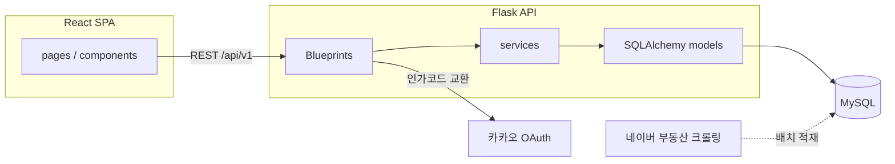
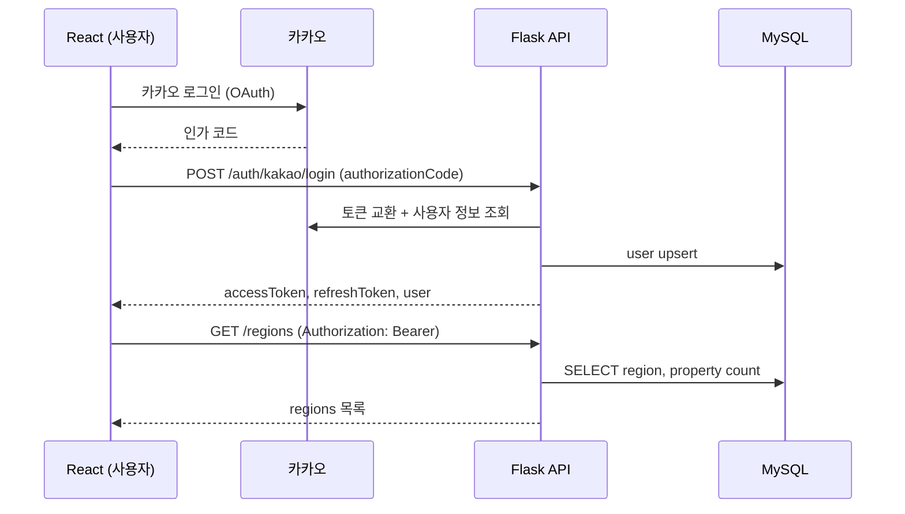

# 아키텍처 명세서 (Architecture Spec)

> 이 문서는 `planning_spec.md`(기획), `feature_spec.md`(기능), `api_spec.md`(API), `erd_spec.md`(DB)를 기반으로, 실제 구현 시 참고할 **Flask 백엔드**와 **React 프론트엔드**의 디렉토리/모듈 구조를 정의한다.

## 1. 개요

| 영역 | 스택 | 비고 |
|---|---|---|
| 프론트엔드 | React (SPA) | `frontend/` — API 서버와 분리된 별도 애플리케이션 |
| 백엔드 | Python (Flask) | `backend/` — REST API 서버, Base URL `/api/v1` |
| 데이터베이스 | MySQL | `erd_spec.md`의 10개 테이블 |
| 인증 | 카카오 로그인(OAuth) → 자체 JWT 발급 | `Authorization: Bearer {token}` |
| 매물 데이터 | 네이버 부동산 크롤링 (배치) | MVP는 수동/스케줄 배치 |

프론트엔드와 백엔드는 완전히 분리된 저장소/프로세스로 두고, HTTP(JSON) API로만 통신한다.



---

## 2. Flask 백엔드 구조

```
backend/
├── app/
│   ├── __init__.py          # Flask app factory, 확장 초기화, 블루프린트 등록
│   ├── config.py            # 환경별 설정 (dev/prod, DB URI, JWT secret, 카카오 client 정보)
│   ├── extensions.py        # SQLAlchemy, Flask-JWT-Extended, CORS, Migrate 등 인스턴스
│   ├── models/               # SQLAlchemy 모델 (erd_spec.md 테이블 매핑)
│   │   ├── user.py
│   │   ├── region.py
│   │   ├── property.py          # Property, PropertyComplex
│   │   ├── property_route.py
│   │   ├── property_amenity.py
│   │   ├── favorite.py
│   │   ├── recent_view.py
│   │   └── compare_history.py   # CompareHistory, CompareHistoryItem
│   ├── api/                  # 블루프린트 (api_spec.md 도메인 매핑)
│   │   ├── auth/              # 1. 카카오 로그인/로그아웃/토큰재발급
│   │   ├── regions/           # 2. 지역 목록
│   │   ├── properties/        # 3. 매물 리스트/상세/편의시설/경로
│   │   ├── favorites/         # 4. 즐겨찾기
│   │   ├── compare/           # 5. 매물 비교
│   │   └── users/             # 6. 마이페이지(내 정보/최근본/비교이력/알림설정)
│   ├── services/              # 도메인 로직 (카카오 토큰 교환, 경로 계산, 비교 bestFields 산출 등)
│   ├── schemas/               # 요청/응답 직렬화·검증 (marshmallow 또는 pydantic)
│   └── errors.py              # 공통 에러 핸들러 (api_spec.md 7절 에러 포맷)
├── crawler/                  # 네이버 부동산 크롤링 배치 스크립트 (MVP: 수동/스케줄 실행)
├── migrations/               # Flask-Migrate/Alembic 마이그레이션
├── tests/
├── requirements.txt
└── wsgi.py                   # 앱 진입점
```

### 2.1 블루프린트 ↔ API 라우트 대응

| 블루프린트 | 라우트 (api_spec.md) |
|---|---|
| `api/auth` | `POST /auth/kakao/login`, `POST /auth/logout`, `POST /auth/token/refresh` |
| `api/regions` | `GET /regions` |
| `api/properties` | `GET /regions/{regionId}/properties`, `GET /properties/{id}`, `GET /properties/{id}/amenities`, `GET /properties/{id}/route` |
| `api/favorites` | `GET /favorites`, `POST /favorites`, `DELETE /favorites/{propertyId}` |
| `api/compare` | `POST /properties/compare` |
| `api/users` | `GET /users/me`, `GET /users/me/recent-viewed`, `GET /users/me/compare-history`, `GET`/`PATCH /users/me/notification-settings` |

### 2.2 모델 ↔ ERD 테이블 대응

| 모델 파일 | 테이블 (erd_spec.md) |
|---|---|
| `models/user.py` | `user` |
| `models/region.py` | `region` |
| `models/property.py` | `property`, `property_complex` |
| `models/property_route.py` | `property_route` |
| `models/property_amenity.py` | `property_amenity` |
| `models/favorite.py` | `favorite` |
| `models/recent_view.py` | `recent_view` |
| `models/compare_history.py` | `compare_history`, `compare_history_item` |

### 2.3 인증 흐름

1. 프론트가 카카오 인가 코드를 `POST /auth/kakao/login`으로 전달
2. `services/kakao.py`(가칭)가 카카오 토큰 교환 + 사용자 정보 조회, `user` 테이블 upsert
3. 서비스 자체 Access/Refresh JWT 발급 (Flask-JWT-Extended)
4. 이후 모든 인증 필요 API는 `Authorization: Bearer {accessToken}` 헤더 검증
5. 만료 시 `POST /auth/token/refresh`로 재발급

---

## 3. React 프론트엔드 구조

```
frontend/
├── src/
│   ├── pages/                 # feature_spec.md 화면 단위
│   │   ├── Landing/                # 01_Landing_로그인전
│   │   ├── RegionSelect/           # 02 지도형 / 02b 리스트형 (토글)
│   │   ├── PropertyList/           # 03 지역매물 리스트+지도
│   │   ├── PropertyDetail/         # 04 매물상세
│   │   ├── RouteDetail/            # 07 경로상세 전체화면
│   │   ├── CompareSelect/          # 08 매물비교 선택
│   │   ├── CompareTable/           # 09 매물비교 테이블
│   │   ├── Favorites/              # favorites / favorites-empty
│   │   └── MyPage/                 # 10 마이페이지
│   ├── components/             # 공통 컴포넌트 (하단 네비게이션 바, 매물 카드, 지도 마커, 필터 칩 등)
│   ├── api/                    # axios 인스턴스 + 도메인별 클라이언트 (api_spec.md 대응)
│   │   ├── client.ts               # baseURL `/api/v1`, 인터셉터(토큰 첨부, 401 재발급)
│   │   ├── auth.ts
│   │   ├── regions.ts
│   │   ├── properties.ts
│   │   ├── favorites.ts
│   │   ├── compare.ts
│   │   └── users.ts
│   ├── hooks/                  # 커스텀 훅 (즐겨찾기 토글, 인증 상태, 정렬/필터 상태 등)
│   ├── store/                  # 전역 상태 (인증 토큰, 선택 지역/정렬 등)
│   ├── router/                 # 라우팅 정의 (하단 네비게이션 실제 화면 전환 연결 포함)
│   ├── types/                  # API 응답 타입 정의 (api_spec.md 응답 스키마 대응)
│   └── App.tsx
├── public/
└── package.json
```

### 3.1 페이지 ↔ 화면 ID 대응

| 페이지 | 화면 ID (feature_spec.md) |
|---|---|
| `pages/Landing` | 01 |
| `pages/RegionSelect` | 02, 02b |
| `pages/PropertyList` | 03 |
| `pages/PropertyDetail` | 04 |
| `pages/RouteDetail` | 07 |
| `pages/CompareSelect` | 08 |
| `pages/CompareTable` | 09 |
| `pages/Favorites` | favorites, favorites-empty |
| `pages/MyPage` | 10 |

### 3.2 인증/라우팅

- Access/Refresh JWT는 `store`(전역 상태) + 안전한 저장소(예: httpOnly 쿠키 또는 메모리+refresh 전략)에 보관
- 비로그인 시 `01 Landing`으로 리다이렉트하는 라우팅 가드 적용
- 하단 네비게이션 바(홈/즐겨찾기/마이페이지)는 Figma 프로토타입에서 시각 요소만 존재하므로, `router/`에서 실제 화면 전환을 연결해야 함 (`feature_spec.md` 공통 컴포넌트 절 참고)

### 3.3 MVP 범위 제한

`planning_spec.md`의 MVP 제외 항목(실시간 채팅/문의, 결제, 리뷰, 관리자 페이지, 회원탈퇴)은 프론트 구조에도 포함하지 않는다. "집주인에게 문의하기" 버튼은 UI만 존재하고 별도 페이지/API 연동 없음.

---

## 4. 백엔드-프론트 연동 요약



- 에러 응답은 공통 포맷(`{ error: { code, message } }`)을 사용하며, 프론트 `api/client.ts` 인터셉터에서 `error.code` 기준으로 분기 처리 (예: 401 → 토큰 재발급 후 재시도, 404 → 안내 메시지)
- 지도 API(카카오맵/네이버지도) 연동 전까지는 `route_polyline`이 `null`이므로, 프론트는 좌표 기반 경로선 없이 소요시간·거리·텍스트 안내만 렌더링
