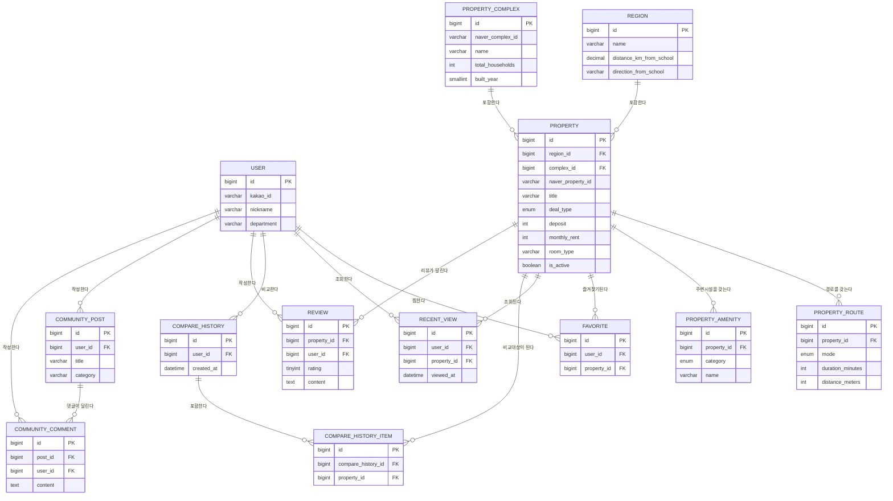

# ERD 명세서 (ERD Spec)

> 대상 DB: MySQL. 모든 테이블은 `id BIGINT AUTO_INCREMENT PK`, `created_at DATETIME NOT NULL DEFAULT CURRENT_TIMESTAMP`를 기본으로 갖는다(표에는 도메인 컬럼 위주로 표기).

## 1. 테이블 목록

| 테이블명 | 설명 |
|---|---|
| `user` | 카카오 로그인 사용자 |
| `region` | 평택/성환/직산/두정 등 지역 |
| `property` | 매물 (네이버 부동산 크롤링 데이터) |
| `property_complex` | 매물이 속한 단지정보 (크롤링 시 함께 수집, 단지형 매물만 존재) |
| `property_route` | 매물별 학교까지 이동수단별 소요시간·거리 |
| `property_amenity` | 매물 주변 편의시설 |
| `favorite` | 사용자-매물 즐겨찾기 (N:M) |
| `recent_view` | 사용자의 최근 본 매물 이력 |
| `compare_history` | 사용자의 매물 비교 세트 이력 |
| `compare_history_item` | 비교 세트에 포함된 매물 (N:M) |
| `review` | 매물 리뷰·평점 |
| `community_post` | 커뮤니티 게시글 |
| `community_comment` | 커뮤니티 게시글 댓글 |

## 2. 테이블 상세

### 2.1 `user`
| 컬럼 | 타입 | PK/FK | NOT NULL | 설명 |
|---|---|---|---|---|
| id | BIGINT | PK | Y | 사용자 ID |
| kakao_id | VARCHAR(64) | - | Y | 카카오 고유 ID (UNIQUE) |
| nickname | VARCHAR(50) | - | Y | 닉네임/이름 |
| department | VARCHAR(100) | - | N | 학과 |
| profile_image_url | VARCHAR(500) | - | N | 프로필 이미지 URL |
| email | VARCHAR(255) | - | N | 카카오 계정 이메일 |
| created_at | DATETIME | - | Y | 가입 일시 |

### 2.2 `region`
| 컬럼 | 타입 | PK/FK | NOT NULL | 설명 |
|---|---|---|---|---|
| id | BIGINT | PK | Y | 지역 ID |
| name | VARCHAR(20) | - | Y | 지역명 (평택/성환/직산/두정) |
| description | VARCHAR(200) | - | N | 지역 설명 (예: "성환읍 · 남서울대학교 소재지") |
| center_latitude | DECIMAL(10,7) | - | Y | 지역 중심 위도 |
| center_longitude | DECIMAL(10,7) | - | Y | 지역 중심 경도 |
| distance_km_from_school | DECIMAL(5,1) | - | Y | 학교로부터 거리(km), 학교 소재 지역은 0 |
| direction_from_school | VARCHAR(10) | - | Y | `north` \| `south` \| `here` |

### 2.3 `property`
| 컬럼 | 타입 | PK/FK | NOT NULL | 설명 |
|---|---|---|---|---|
| id | BIGINT | PK | Y | 매물 ID |
| region_id | BIGINT | FK → region.id | Y | 소속 지역 |
| complex_id | BIGINT | FK → property_complex.id | N | 소속 단지 (일반 원/투룸은 NULL) |
| naver_property_id | VARCHAR(50) | - | Y | 네이버 부동산 원본 매물 ID (UNIQUE, 크롤링 중복 방지용) |
| title | VARCHAR(200) | - | Y | 매물명 |
| address | VARCHAR(300) | - | Y | 지번/도로명 주소 |
| latitude | DECIMAL(10,7) | - | Y | 위도 |
| longitude | DECIMAL(10,7) | - | Y | 경도 |
| deal_type | ENUM('MONTHLY','JEONSE','SALE') | - | Y | 거래유형 (MVP는 MONTHLY만 노출) |
| deposit | INT | - | Y | 보증금 (원) |
| monthly_rent | INT | - | N | 월세 (원), 전세/매매는 NULL |
| maintenance_fee | INT | - | N | 관리비 (원) |
| room_type | VARCHAR(20) | - | Y | 원룸/투룸 등 |
| area_m2 | DECIMAL(6,2) | - | N | 전용면적 |
| floor_info | VARCHAR(20) | - | N | 층수 정보 (예: "3층/5층") |
| thumbnail_url | VARCHAR(500) | - | N | 대표 썸네일 URL |
| photo_urls | JSON | - | N | 사진 URL 목록 |
| is_active | BOOLEAN | - | Y | 매물 노출 여부 (만료/삭제 시 false) |
| listed_at | DATETIME | - | N | 네이버 부동산 매물 등록일 |
| crawled_at | DATETIME | - | Y | 마지막 크롤링 수집 일시 |

### 2.4 `property_complex` (단지정보 — 프론트 UI 미반영, DB만 선반영)
| 컬럼 | 타입 | PK/FK | NOT NULL | 설명 |
|---|---|---|---|---|
| id | BIGINT | PK | Y | 단지 ID |
| naver_complex_id | VARCHAR(50) | - | Y | 네이버 부동산 원본 단지 ID (UNIQUE) |
| name | VARCHAR(200) | - | Y | 단지명 |
| building_type | VARCHAR(30) | - | N | 아파트/오피스텔/빌라 등 |
| total_households | INT | - | N | 총 세대수 |
| built_year | SMALLINT | - | N | 준공년도 |
| parking_count | INT | - | N | 총 주차대수 |
| heating_type | VARCHAR(30) | - | N | 난방방식 |
| address | VARCHAR(300) | - | N | 단지 주소 |

### 2.5 `property_route`
| 컬럼 | 타입 | PK/FK | NOT NULL | 설명 |
|---|---|---|---|---|
| id | BIGINT | PK | Y | 경로 ID |
| property_id | BIGINT | FK → property.id | Y | 대상 매물 |
| mode | ENUM('WALK','BUS','BIKE','TAXI') | - | Y | 이동수단 |
| duration_minutes | INT | - | Y | 소요시간(분) |
| distance_meters | INT | - | Y | 거리(m) |
| route_steps | JSON | - | N | 단계별 경로 설명 목록 |
| route_polyline | TEXT | - | N | 경로 좌표 (지도 API 연동 후 채움, 현재 NULL 가능) |
| updated_at | DATETIME | - | Y | 마지막 갱신 일시 |

- UNIQUE(`property_id`, `mode`) — 매물당 이동수단별 1건

### 2.6 `property_amenity`
| 컬럼 | 타입 | PK/FK | NOT NULL | 설명 |
|---|---|---|---|---|
| id | BIGINT | PK | Y | 편의시설 ID |
| property_id | BIGINT | FK → property.id | Y | 대상 매물 |
| category | ENUM('CONVENIENCE_STORE','CAFE','GYM') | - | Y | 편의시설 종류 |
| name | VARCHAR(100) | - | Y | 상호명 |
| latitude | DECIMAL(10,7) | - | N | 위도 |
| longitude | DECIMAL(10,7) | - | N | 경도 |
| distance_meters | INT | - | N | 매물로부터 거리(m) |

### 2.7 `favorite`
| 컬럼 | 타입 | PK/FK | NOT NULL | 설명 |
|---|---|---|---|---|
| id | BIGINT | PK | Y | ID |
| user_id | BIGINT | FK → user.id | Y | 사용자 |
| property_id | BIGINT | FK → property.id | Y | 매물 |
| created_at | DATETIME | - | Y | 즐겨찾기 등록 일시 |

- UNIQUE(`user_id`, `property_id`)

### 2.8 `recent_view`
| 컬럼 | 타입 | PK/FK | NOT NULL | 설명 |
|---|---|---|---|---|
| id | BIGINT | PK | Y | ID |
| user_id | BIGINT | FK → user.id | Y | 사용자 |
| property_id | BIGINT | FK → property.id | Y | 매물 |
| viewed_at | DATETIME | - | Y | 조회 일시 (재조회 시 갱신) |

- UNIQUE(`user_id`, `property_id`) — 재조회 시 `viewed_at` UPSERT

### 2.9 `compare_history`
| 컬럼 | 타입 | PK/FK | NOT NULL | 설명 |
|---|---|---|---|---|
| id | BIGINT | PK | Y | 비교 세트 ID |
| user_id | BIGINT | FK → user.id | Y | 사용자 |
| created_at | DATETIME | - | Y | 비교 실행 일시 |

### 2.10 `compare_history_item`
| 컬럼 | 타입 | PK/FK | NOT NULL | 설명 |
|---|---|---|---|---|
| id | BIGINT | PK | Y | ID |
| compare_history_id | BIGINT | FK → compare_history.id | Y | 소속 비교 세트 |
| property_id | BIGINT | FK → property.id | Y | 비교 대상 매물 |

- UNIQUE(`compare_history_id`, `property_id`)

### 2.11 `review`
| 컬럼 | 타입 | PK/FK | NOT NULL | 설명 |
|---|---|---|---|---|
| id | BIGINT | PK | Y | 리뷰 ID |
| property_id | BIGINT | FK → property.id | Y | 대상 매물 |
| user_id | BIGINT | FK → user.id | Y | 작성자 |
| rating | TINYINT | - | Y | 별점 (1~5) |
| content | TEXT | - | Y | 리뷰 내용 |
| created_at | DATETIME | - | Y | 작성 일시 |

- UNIQUE(`user_id`, `property_id`) — 매물당 사용자 1건의 리뷰만 허용

### 2.12 `community_post`
| 컬럼 | 타입 | PK/FK | NOT NULL | 설명 |
|---|---|---|---|---|
| id | BIGINT | PK | Y | 게시글 ID |
| user_id | BIGINT | FK → user.id | Y | 작성자 |
| title | VARCHAR(200) | - | Y | 제목 |
| content | TEXT | - | Y | 본문 |
| category | VARCHAR(20) | - | N | 카테고리 (자유/질문/정보 등) |
| created_at | DATETIME | - | Y | 작성 일시 |

### 2.13 `community_comment`
| 컬럼 | 타입 | PK/FK | NOT NULL | 설명 |
|---|---|---|---|---|
| id | BIGINT | PK | Y | 댓글 ID |
| post_id | BIGINT | FK → community_post.id | Y | 대상 게시글 |
| user_id | BIGINT | FK → user.id | Y | 작성자 |
| content | TEXT | - | Y | 댓글 내용 |
| created_at | DATETIME | - | Y | 작성 일시 |

## 3. 테이블 관계 요약

- `region` **1 : N** `property` — 지역 하나에 매물 여러 개
- `property_complex` **1 : N** `property` — 단지 하나에 매물 여러 개 (nullable FK)
- `property` **1 : N** `property_route` — 매물 하나에 이동수단별 경로 최대 4건
- `property` **1 : N** `property_amenity` — 매물 하나에 편의시설 여러 개
- `user` **N : M** `property` (through `favorite`) — 즐겨찾기
- `user` **N : M** `property` (through `recent_view`) — 최근 본 매물
- `user` **1 : N** `compare_history` — 사용자의 비교 이력
- `compare_history` **N : M** `property` (through `compare_history_item`) — 비교 세트에 속한 매물들 (2~4개)
- `property` **1 : N** `review` — 매물 하나에 리뷰 여러 개
- `user` **1 : N** `review` — 사용자가 작성한 리뷰
- `user` **1 : N** `community_post` — 사용자가 작성한 게시글
- `community_post` **1 : N** `community_comment` — 게시글에 달린 댓글
- `user` **1 : N** `community_comment` — 사용자가 작성한 댓글

## 4. ER 다이어그램

## 5. 추후 고도화 시 고려
- `property`에 매물 가격/상태 변경 이력을 남기는 별도 히스토리 테이블 (가격 변동 알림 기능용)
- 크롤링 배치 실행 로그를 위한 `crawl_log` 테이블
- 편의시설 카테고리 확장 시 `property_amenity.category`를 참조 테이블로 정규화
- 리뷰 신고/블라인드 처리를 위한 상태 컬럼 또는 별도 테이블
- 커뮤니티 게시글 조회수·좋아요 집계
