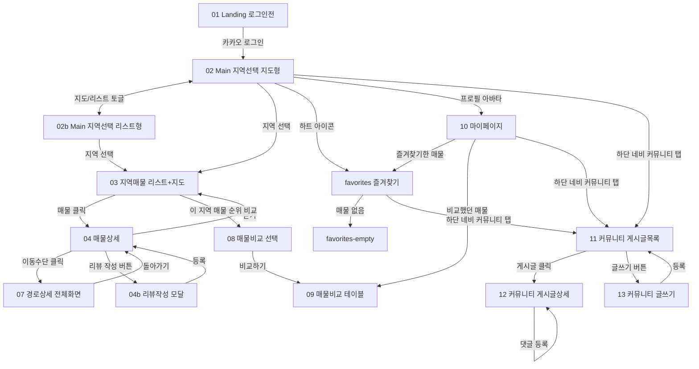

# 기획 명세서 (Planning Spec)

> 남자방 — 남서울대학교 자취방 정보 플랫폼 (학교 프로젝트 MVP)
> 이 문서는 Figma 디자인(01_Landing ~ 10_마이페이지, 02b 포함)을 기준으로 작성되었습니다.

## 1. 서비스 정의

**남자방**은 남서울대학교 학생을 위한 자취방(원룸/투룸 월세) 검색 플랫폼이다. 네이버 부동산 매물을 크롤링해 지역별 지도 위에 보여주고, 학교까지의 도보·버스·자전거·택시 소요시간을 자동으로 계산해 보여준다.

- **타겟 사용자**: 남서울대학교 재학생 (특히 자취방을 처음 구하는 신입생·편입생)
- **핵심 가치 제안**
  1. 평택·성환·직산·두정 4개 지역의 매물을 지도 기반으로 한눈에 비교
  2. 매물마다 학교까지의 이동수단별 소요시간을 자동 계산해서 제공
  3. 관심 매물끼리 가격·거리·편의시설을 나란히 비교하는 기능 제공

## 2. 기술 스택

| 영역 | 스택 |
|---|---|
| 프론트엔드 | React (SPA, AI 생성 후 별도 구현 — 본 문서 범위 아님) |
| 백엔드 | Python (Flask) |
| 데이터베이스 | MySQL |
| 인증 | 카카오 로그인 (OAuth) |
| 지도 | 지도 API 연동 예정 (예: 카카오맵/네이버지도) — 현재 디자인은 스타일라이즈드 목업, 실제 좌표 렌더링은 추후 연동 |
| 매물 데이터 | 네이버 부동산 크롤링 |

## 3. 전체 화면 목록

| ID | 화면명 | 목적 |
|---|---|---|
| 01 | Landing (로그인 전) | 비로그인 사용자에게 서비스를 소개하고 카카오 로그인으로 유도 |
| 02 | Main 지역선택 (지도형) | 로그인 후 첫 화면. 학교를 중심으로 4개 지역을 지도 위에서 선택 |
| 02b | Main 지역선택 (리스트형) | 지도가 불편한 사용자를 위한 지역 리스트 대체 뷰 |
| 03 | 지역매물 리스트+지도 | 선택한 지역의 매물을 리스트+지도로 탐색, 정렬/필터 |
| 04 | 매물상세 | 매물 상세 정보 확인, 주변 편의시설, 학교까지 이동시간 확인 |
| 07 | 경로상세 전체화면 | 특정 이동수단 기준 학교까지의 상세 경로·소요시간 확인 |
| 08 | 매물비교 선택 | 비교할 매물을 최대 4개까지 선택 |
| 09 | 매물비교 테이블 | 선택한 매물을 속성별로 나란히 비교 |
| favorites | 즐겨찾기 | 찜한 매물 목록 확인 |
| favorites-empty | 즐겨찾기 (빈 상태) | 찜한 매물이 없을 때의 안내 화면 |
| 10 | 마이페이지 | 내 정보, 즐겨찾기/최근 본/비교 이력, 설정 진입점 |
| 11 | 커뮤니티 게시글목록 | 자취 관련 커뮤니티 게시글 목록 확인, 카테고리별 필터, 글쓰기 진입 |
| 12 | 커뮤니티 게시글상세 | 게시글 본문/댓글 확인, 댓글 작성 |
| 13 | 커뮤니티 글쓰기 | 새 게시글 제목/내용 작성 후 등록 |

## 4. 전체 유저 플로우

## 5. MVP 범위

### 포함
- 카카오 로그인/로그아웃
- 지역 목록 조회 (매물 개수 포함), 지도형/리스트형 전환
- 지역별 매물 리스트 (정렬: 거리순/교통순/가격순, 필터: 주변 편의시설)
- 매물 상세, 주변 편의시설, 학교까지 이동수단별(도보/버스/자전거/택시) 소요시간·경로
- 즐겨찾기 등록/삭제/목록 (지역 필터, 정렬 포함), 빈 상태 UI
- 매물 비교 (최대 4개 선택 → 속성별 비교 테이블)
- 마이페이지 (내 정보, 즐겨찾기/최근 본/비교 이력 진입점)
- 매물 리뷰·평점 (매물 상세 내 평균 별점/리뷰 개수/리뷰 목록 표시, 별점+내용 리뷰 작성)
- 커뮤니티 (게시글 목록/카테고리 필터, 게시글 상세, 댓글, 게시글 작성)

### 제외 (추후 고도화 시 고려)
- 실시간 매물 크롤링 자동화(주기적 배치/증분 수집 파이프라인, 캐싱 전략) — MVP는 수동/스케줄 배치로 적재된 데이터를 그대로 제공
- 집주인 실시간 채팅·문의, 알림 실제 발송(푸시/문자)
- 결제, 계약 진행 기능
- 관리자 페이지, 회원 탈퇴 플로우
- 커뮤니티 게시글/댓글 신고·모더레이션(운영 관리)
- 하단 네비게이션 바의 실제 화면 전환 연결(현재 Figma 프로토타입에는 시각 요소만 존재) — 프론트 구현 시 라우팅으로 연결 필요

### 참고: 매물 상세 UI 관련
매물 상세(04) 화면은 현재 Figma에 그려진 정보(사진, 가격, 주소, 주변 편의시설, 이동시간)까지만 반영되어 있다. 네이버 부동산 크롤링 시 함께 수집되는 **단지정보**(건축년도, 총 세대수, 주차대수, 난방방식 등)는 아직 화면에 그려지지 않았지만, 크롤링 데이터에는 포함될 예정이므로 DB/ERD 설계에는 별도 테이블(`property_complex`)로 미리 반영해둔다. 프론트 UI는 추후 이 데이터를 노출하는 섹션이 추가될 수 있다.
